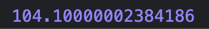
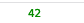
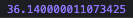

# Performance.now

performance.now() 메소드는 실행될때 window컨택스트가 생성된 이후 경과된 시간을 DOMHighResTimeStamp유형으로 원래는 5마이크로 초(us)까지 정확한 시간을 반환하게끔 만들어졌다. 하지만 브라우저가 5마이크로 초까지 정확하게 시간 값을 제공할 수 없는 경우(하드웨어나 소프트웨어의 제한사항으로) 밀리 초(ms)단위까지 나타낼 수 있게 되어있다. 현재 대부분의 브라우저에서는 마이크로 초에서 어느정도 반올림하여 보여주고있다. MDN의 문서에 따르면 Firefox는 Firefox 60버전부터 아예 1ms로 반올림하여 보여주고 있다고 한다.(2021년 6월 17일 기준) 추후 업데이트에서는 정밀도가 다시 향상될 수 있다고 한다.

## 실제 브라우저에서의 비교

### ms와 us
> ms는 잘 알고 있듯이 1/1000초이다. 즉, 1000ms가 1초이다. 잡담이라면 사람이 보통 눈을 깜빡이는 시간이 300ms라고 한다.

> us는 1/1000000(백만분의 일)초이다. 사실 표기가 정확히 u가 아니지만 편의상 u로 표기하겠다. s와 ms의 관계와 마찬가지로 1/1000ms이다. 크롬 브라우저에서 0.~~~~~ms단위가 소수점 14자리까지 표시가 되고어 실제로는 나노초까지 표기가 되는것 같지만 문서의 내용을 따른다면 아마 0.005ms 간격으로 측정이 가능하다고 보면 될 것 같다.

### Chrome

### Firefox

### Opera

크롬만 값의 차이가 많이나는 이유는 잘은 모르겠으나 Performence.now의 문서를 읽어보면 일부 브라우저에서 타임 스탬프를 약간 무작위 할 수도 있다고 하는데 그 때문이 아닌가 싶다.(추측)